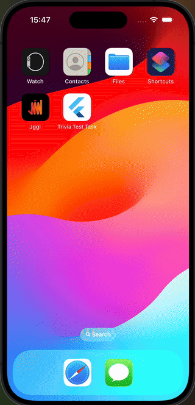

# trivia_test_task

Trivia quiz app

## 1. Environment

Required Flutter sdk >= 3.19.0

## 2. Architecture

Clean Architecture + BloC
Dependency Injection: GetIt
Domain layer: models, repositories, use-cases.
Data layer: entities, mappers from entities to domain model, implementations of repositories and
providers.
Presentation layer: screens + bloc

## 3. Project structure

Folders: core, core_ui, navigation, data, domain.
For presentation layer every feature is a separate folder.

## 4. Presentation layer abstractions

Base and frequently used widgets are stored in core_ui module.
Example: CustomScreen -> CustomForm
Navigation is implemented using Go Router
Router is stored in DI container and is injected in cubits via constructor.

## 5. Localization

Localization is implemented using EasyLocalization service.

## 6. Supported platforms

Mobiles - iOS and Android

## 7.Caching Strategy

The API provides a session token mechanism to ensure that quiz questions remain unique across multiple requests. Based on this, the caching strategy is implemented as follows:

- **Quiz categories** are fetched once and stored in cache after the initial request. All subsequent requests use the cached data.

- **Quiz questions for a specific category** are cached after each successful API request. However, questions are only retrieved from the cache once the API returns a response indicating that all unique questions for the selected category have been exhausted.

## How to run

1. Install Flutter
2. Install Android Studio
3. Install XCode (only for MacOS)
4. Install CocoaPods (only for MacOS)
5. Install Flutter and Dart plugins for Android Studio
6. Install XCode command line tools
7. Run `flutter doctor` and fix all issues
8. Run `flutter pub get` to get dependencies
9. Run `dart run build_runner build --delete-conflicting-outputs` to generate models and entities
10. Run `dart run easy_localization:generate -f keys -o locale_keys.g.dart -O lib/core/localization -S assets/translations` to generate locale keys
11. Run project by `flutter run` command
